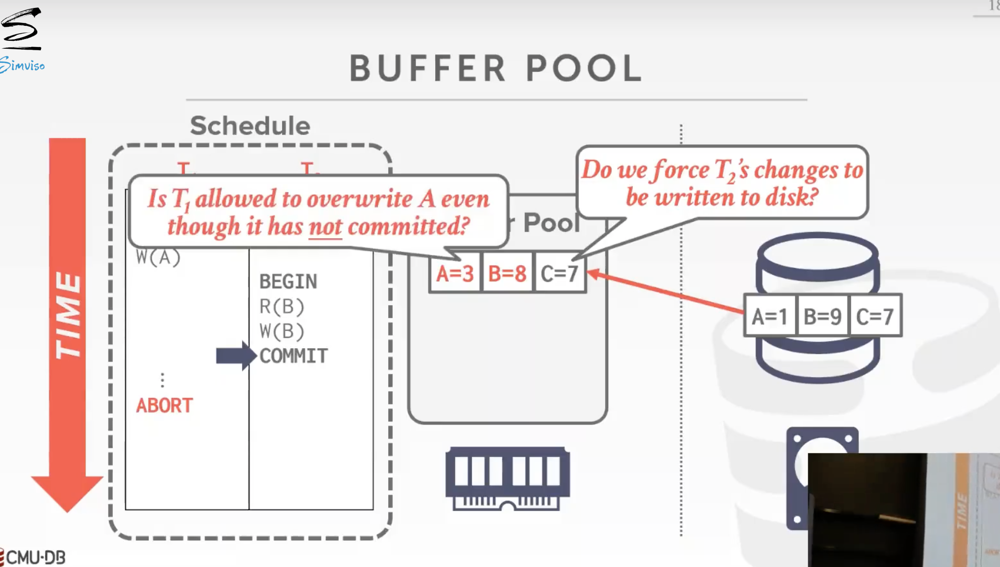

# Logging Protocols + Schemes

## 1. Crash Recovery

恢复算法是确保DB一致性、事务原子性以及持久性的技术。

任何故障恢复算法包括 **两部分**：

- 运行时：txn执行时记录可以保证DB故障后恢复的信息
- 故障时：故障后使DB恢复到一个保证atomicity、consistency以及durability的状态的操作

故障恢复算法的两个关键原语（并不是所有故障恢复算法都有）：

- **UNDO**：撤销未提交事务在disk上的修改
- **REDO**：重新执行已提交事务为被持久化的修改

## 1.5. 故障类型

因为DBMS根据底层存储设备分为不同的组件，所以有许多不同类型的故障需要DBMS来处理。其中一些故障是可以恢复的，而另一些则不能。
### 类型#1：事务故障
当一个事务遇到一个错误而必须中止时，就会发生事务故障。有两种类型的错误会导致交易失败，即逻辑错误和内部状态错误。
- 逻辑错误。由于某些内部错误条件（例如，完整性，违反约束），事务无法完成。
- 内部状态错误。DBMS必须由于错误状况（例如，死锁）而终止一个正在进行的事务。

### 类型#2：系统故障

系统故障是硬件或软件的非故意故障，在崩溃恢复协议中也必须考虑到。
- 软件故障。DBMS的实现有问题（例如，未捕获的除以0的异常），系统必须停止运行。
- 硬件故障。托管DBMS的计算机崩溃了（例如，电源插头被拔掉）。我们假设非易失性存储内容不会被系统崩溃破坏。

### 类型#3：存储介质故障

存储介质故障是物理存储机损坏时发生的不可修复的故障。当存储介质发生故障时，DBMS必须从存档的版本中恢复。
- 不可修复的硬件故障。磁头崩溃或类似的磁盘故障会破坏所有或部分的非易失性存储。破坏被认为是可检测的。

## 2. Buffer Pool Management Policies

DBMS需要确保以下保证
- 一旦DBMS告诉某人它已提交，事务的任何变化都是durable的。
- 如果事务中止了，没有任何变化是durable的。

### 2.1. Steal Policy

DBMS是否允许**未提交事务**修改非易失性存储中被已提交事务修改过的对象（事务是否可以往disk上写未提交的修改）

思考方式：如果一个事务需要一个page, 但内存池没有free page， 是否允许该事务从一个其他未提交的事务手上steal内存池里的一个page

- STEAL: Is allowed
- NO-STEAL: Is not allowed.

### 2.2. Force Policy

在事务提交前，DBMS确保事务所做的修改反映在非易失性存储上。

- FORCE: Is required
- NO-FORCE: Is not required

### 2.3. 不同策略效果

- **STEAL/NO-FORCE**：性能最好，也带来更复杂的日志设计和恢复处理。需要UNDO和REDO。
- **STEAL/FORCE**：仅需要UNDO能力。
- **NO-STEAL/NO-FORCE**：仅需要REDO能力。
- **NO-STEAL/FORCE**：什么也不需要，性能最差，需要大量内存。

## 3. Shadow Paging

DBMS为page维护master和shadow：

- **master**：仅包含已提交事务做的修改
- **shadow**：保存未提交事务做的修改

事务在shadow上写。当事务提交时，原子性地切换shadow为master。

**策略**： **NO-STEAL/FORCE**

**实现**：

> 主要思路类似fork，采用了COW的方法，避免了对整个数据库的拷贝，采用对需要进行写操作的page进行拷贝的方式

- 将DB pages组织为树状，root是一个disk page
- root指向master，在shadow上进行更新
- 事务提交时，将root指向shadow，并将修改后的root page落盘，然后修改内存中指针，即交换master和shadow

**UNDO**：不需要，移除shadow page即可

**REDO**：不需要

**缺点**：

- 复制page的成本同样很高
- 提交时的刷盘是随机IO，性能低下
- 会有磁盘碎片，浪费空间

## 4. Write-Ahead Logging

维护一个记录对DB修改的log

- log保存在持久化存储中
- log包含进行UNDO和REDO的足够信息

**策略**：**STEAL/NO-FORCE**

- STEAL: 在事务被实际提交前，只要这些事务所对应的日志记录先落地到磁盘，那我们就能将这些dirty page写出到磁盘(即对对象的修改sink到磁盘的时间是其被换出到磁盘的时间)

- NO-FORCE: 我们不要求事务对对象所做的所有修改都落地到磁盘，仅要求log records落地到磁盘

**WAL协议**：

- DBMS将事务的log records存在buffer pool的page中
- DBMS需要在**被修改的objects落盘之前**将相关的log落盘
- 对于一个事务，在**它的log records落盘之后**，它才可以提交
- 事务开始时log记录`<BEGIN>` 
- 事务结束时，log中记录 `<COMMIT>`，确保事务提交前所有的log records落盘
- 每个log entry包含object的一些信息：
  - Transaction ID
  - Object ID
  - Before Value (UNDO)
  - After Value (REDO)
- 可以使用 **group commit** 去分批flush多个事务的log，以提高性能
- 把脏页写入磁盘的时间时任意的，只是必须是在将log records flush进磁盘之后

**优点**：写入是顺序IO，性能好（写入放大小）

**缺点**：恢复时要重新执行事务，耗时长

## 5. Logging Schemes

### 5.1. Physical Logging

- 记录磁盘物理位置上所做的字节级变化
- 如：git diff

### 5.2. Logical Logging

- 记录 txn high-level 的操作
- 如事务中的 UPDATE、DELETE、INSERT
- 相对于physical logging，写入的数据更少
- 缺点：
  - 恢复时要重放每个txn，因此使用时间更多
  - 如果有并行txn，很难实现logical logging，因为很难确定一个query已经修改了DB的哪一部分

### 5.3. Physiological Logging

- log records针对单个page，但不需要指定page的数据组织方式
- 混合方法，日志记录针对单一页面，但不指定页面的数据组织。也就是说，根据页面中的slot来识别tuple（object id），而不指定变化在页面中的确切位置。因此，DBMS可以在日志记录被写入磁盘后重新组织page。
- 使用最广泛的方式
  

>简而言之，physical记录了事务的字节级变更，logical记录了事务的操作变更，physiological记录了事务的对象/tuple级变更

## 6. CheckPoints

log会逐渐变多，占用很大空间，且恢复时需要执行整个log，导致需要很长恢复时间。

因此DBMS可以定时生成 **checkpoint**，它flush 所有的page。

**多久生成一个checkpoint**：太频繁会导致大量IO从而降低性能、太少会导致恢复时需要太多时间以及需要更多空间存储。Andy认为当log中的数据达到一定数量时才制作checkpoint是比较好的方式。

**Blocking CheckPoint Implementation**：

- DBMS停止接收新的事务，并等待所有活跃事务完成
- 刷新所有log和dirty data page到disk
- 在log中写入`<CHECKPOINT>`，并将该log刷入disk

