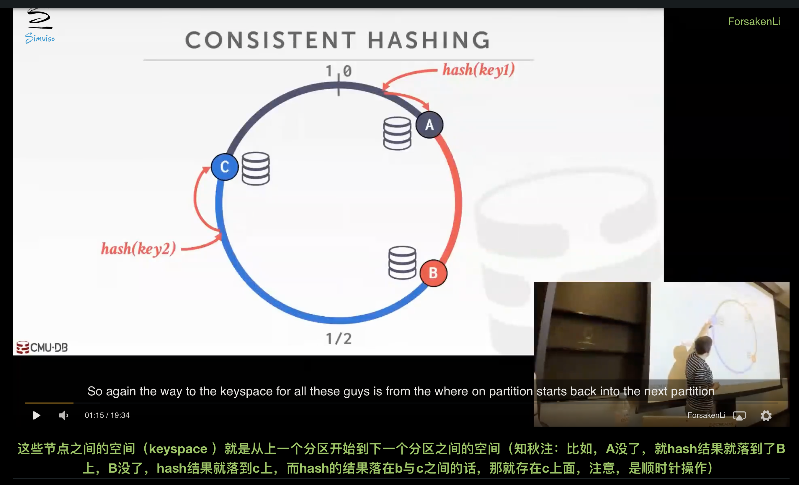
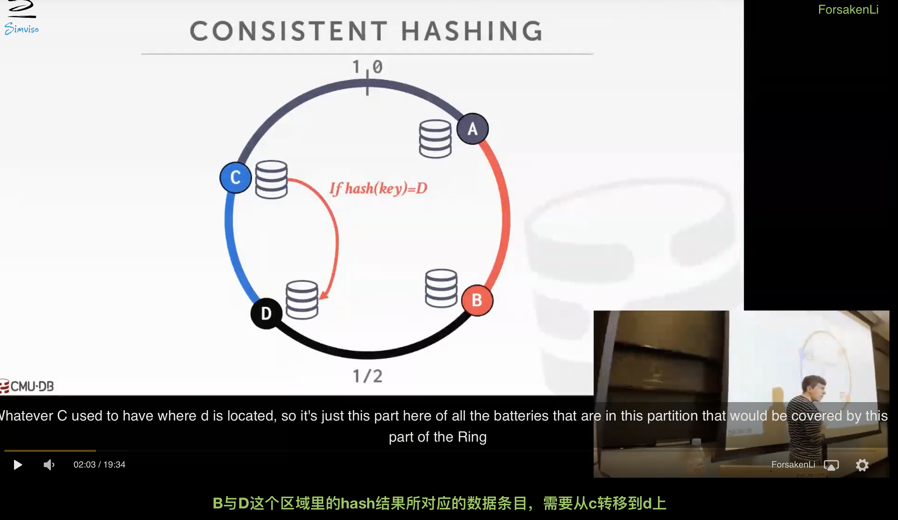
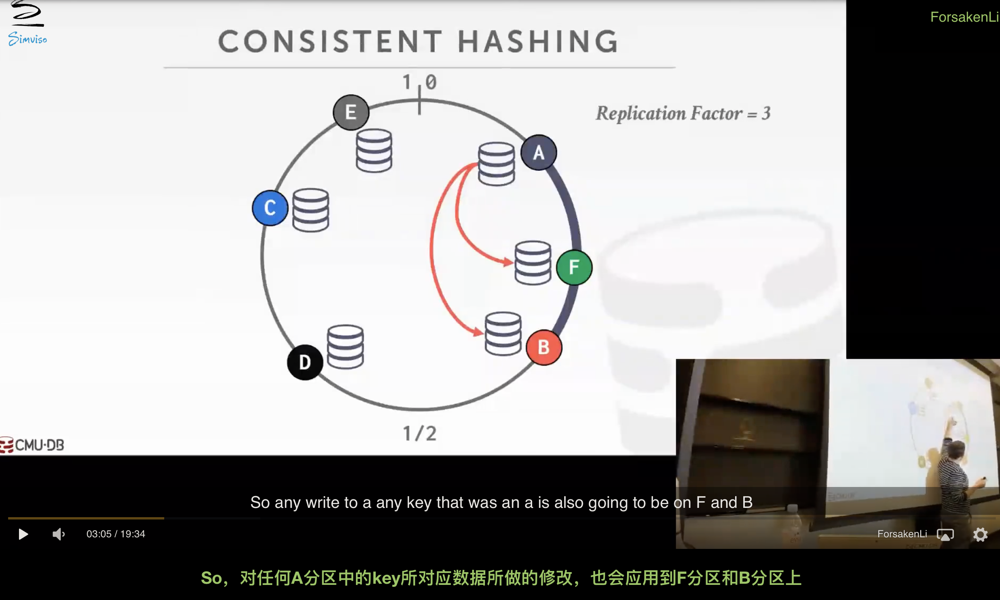
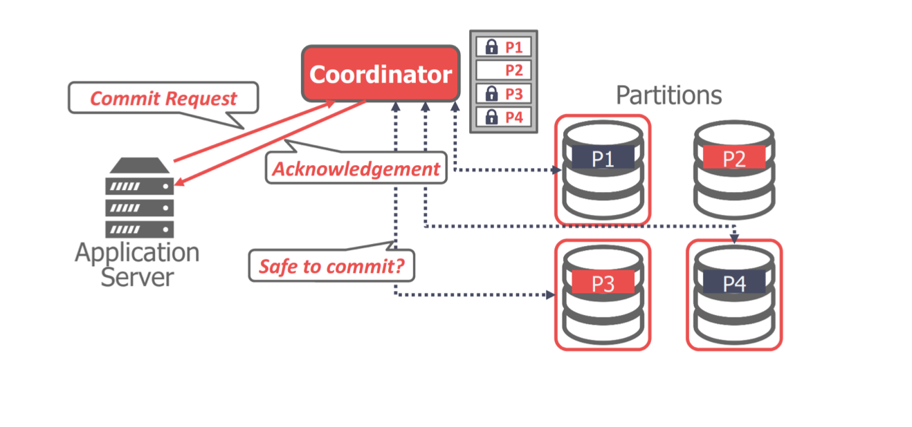
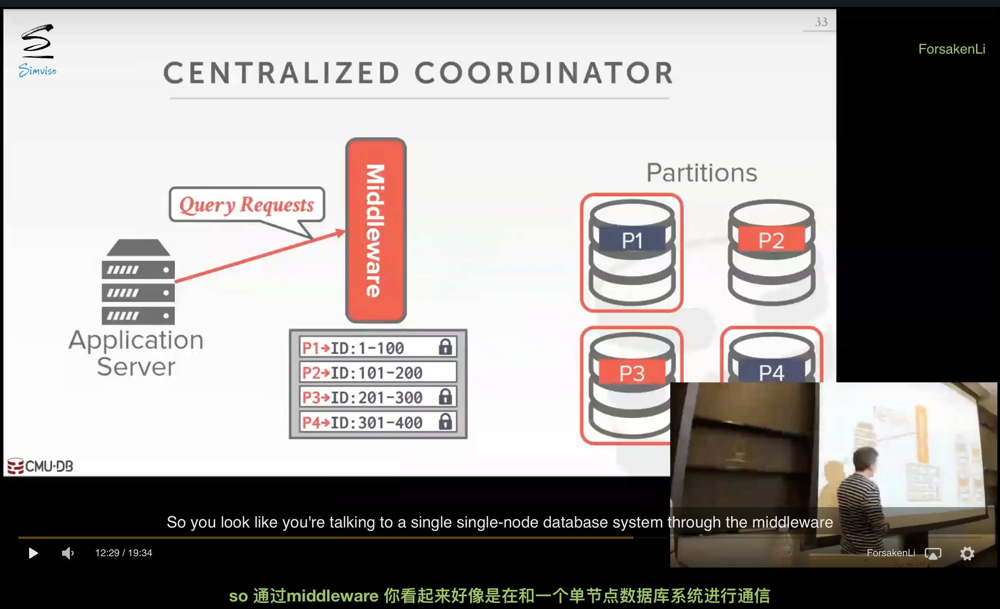

# Introduction to Distributed Databases

## 0. 引言

分布式DBMS将一个单一的逻辑数据库划分到多个物理机上。上层应用程序（通常）不知道数据被分割在不同的硬件上。该系统依靠单节点DBMS的技术和算法来支持分布式环境下的事务处理和查询执行。设计分布式DBMS的一个重要目标是容错性（即避免单一的一个节点故障导致整个系统瘫痪）。

并行数据库:
- 节点在物理上是相互靠近的。
- 节点通过高速LAN（快速、可靠的通信结构）连接。
- 节点之间的通信成本被认为是很小的。

分布式数据库:
- 节点之间可以相隔很远。
- 节点有可能通过公共网络连接，而公共网络可能是缓慢和不可靠的。
- 通信成本和连接问题不能被忽视（例如，节点可能崩溃，数据包可能被丢弃）

## 1. 系统架构

区别在于CPU如何访问到mem和disk。

### 1.1. Shared Everything

- 单节点DBMS使用
- 单节点使用本地的CPU、mem和disk执行任务

### 1.2. Shared Memory

- CPU通过互连访问(interconnect)共用的mem和disk
- 每个processor上的DBMS实例需要知道别的实例的情况
- 需要在OS kernel级别上实现，因此没有数据库使用。
- 因为每个进程的地址空间都在同一个mem上，mem可能被多个进程修改，容易导致故障
- 一般用于高性能计算

### 1.3. Shared Disk

- 每个CPU有各自的mem，但通过网络共享一个disk(如HDFS,S3等)
- 最普遍的云原生数据库
- 存储与计算分离，添加新的存储和计算节点不会影响数据在另一个层的分布
- 计算节点间需要互传信息来获取别的节点的当前状态。即，因为mem是本地的，如果mem中数据更改，修改需要告诉别的节点
- 存储层有故障恢复功能，计算节点是无状态的，发生了故障不会影响别的计算节点
- shared disk和shared memory体系下，cpu越多，对内存访问和网络带宽竞争更大，性能反而更低

### 1.4. Shared Nothing

- 每个DBMS有自己的CPU、mem和disk，节点通过网络通信
- 不容易扩容，因为DBMS需要移动数据到新的节点
- 不容易确保一致性，因为节点间必须通过网络来协调事务状态
- 增加cpu也增加对应的mem，因此可以保证每个事务处理时间不变
- 性能更好，因为降低了竞争资源的等待时间

## 2. Design Decision

### 2.1. 同构模式

集群中的每个节点可以执行相同的任务。故障恢复很容易

### 2.2. 异构模式

每个节点被安排特定的任务。

一个任务涉及多个节点时，需要节点间通过网络进行协调。

扩展性更好。

## 3. partition

通过某种方式将数据分为不相交的部分，并保存在不同的节点上。

### 3.1. 一致性哈希算法

一致性哈希法将每个节点分配到某个逻辑环上的一个位置。然后，每个分区密钥的哈希值都映射到环上的某个位置。在**顺时针方向**上最接近密钥的节点对该密钥负责。当一个节点被添加或移除时，密钥只在与新/移除的节点相邻的节点之间移动。

允许在不移动任何东西的情况下，对集群中的分区进行增量更新和移除

static hashing disadvantage：当增加和删除分区时，需要对key和服务器进行重新映射

一致性hash：增加服务器时，只需要将它顺时针方向下一个服务器中的数据按照hash值转移

#### Consistency hash replica

复制系数(replication factor)为n意味着每个密钥在顺时针方向上被复制在最接近的n个节点上。

## 4. 分布式并发控制

需要协调并行事务在分布式数据库中的执行。

### 4.1. Centralized

- 有一个coordinator
- client通过coordinator获取它想访问的partition的lock
- 一旦它收到ack，就发送query给partition
- 一旦一个事务的所有query执行结束，client发送commit请求给coordinator
- coordinator与事务访问的partitions通信确保事务允许提交

### 4.2. Decentralized

- node自治
- client直接发送query给任意一个partition
- home partition会回复client查询结果
- 写请求还是需要发送给home partition
- home partition负责和其他partition的通信以及最后的commit
- 集中式方法在多个客户试图获得相同分区的锁的情况下会产生瓶颈。这对分布式2PL来说可能更好，因为它对锁有一个中央视图，可以更快处理死锁。这在分散式方法中是不难做到的。

### 4.3 Middleware

集中式协调器可以作为中间件，它接受查询请求并将查询路由到正确的分区。

