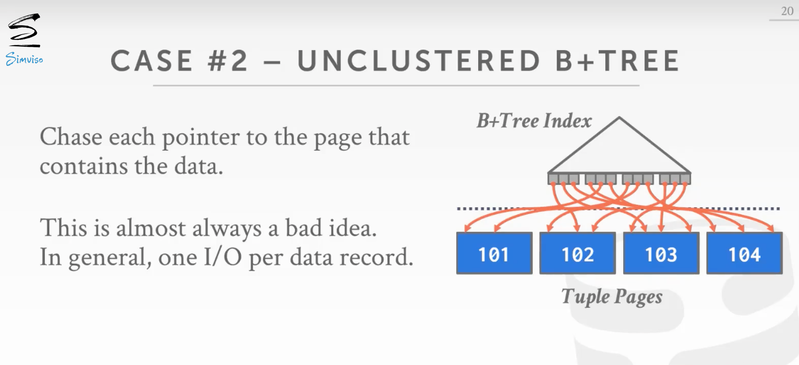
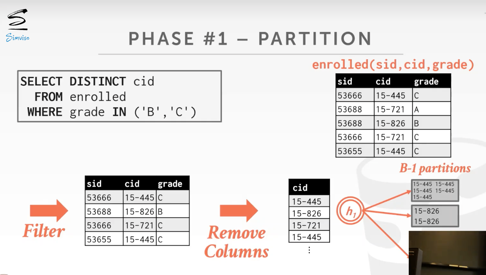

# Sorting and Aggregations

## 查询计划（query plan）

- 查询计划指的是指令，或者是数据库系统该如何执行一个给定查询的方式
- 查询计划被整理为一个树形结构或者是一个有向无环图，每个节点是一个operator
- 数据从树的叶子流向树根
- 根节点的输出是查询的结果

## 磁盘型数据库的operator问题

磁盘型数据库，各个operator产生的中间结果也没法完整放在内存中。

- 设计的operator算法要使用buffer pool manager
- 使用最大化顺序访问的算法

## 排序

- 在关系模型中，tuple间是没有指定的顺序的
- 但是很多query希望以有序的方式访问tuple
  - 根据属性去重（DISTINCT）
  - Aggregation（GROUP BY）
  - 加载大量数据，将其排序并自下至上地构建B+Tree索引，会更快
- 如果数据可以加载在内存中，则DBMS可以使用标准排序算法，如快速排序；若数据不可以全部加载在内存中，则DBMS需要使用外部排序算法，这样需要磁盘，且倾向于使用顺序访问而非随机访问, 因为随机访问的位置可能不在内存中，会带来大量的page fault。

## 外部归并排序（External Merge Sort）

### 排序过程

假如有B个buffer page可用，总的数据量为N个buffer page

- **Sorting**：在mem中对数据块（runs）进行排序，将排序后的runs写入到disk上的子文件。一个run的大小为B个buffer page。
- **Merging**：将排好序的子文件合并成更大的有序文件，一次merge B-1个runs，用一个page存储排序结果，排满一个page时，将其写到disk中。

### Two-way Merge Sort

该算法的最基本版本是双向合并排序。该算法在排序阶段读取每一页，对其进行排序，并将排序后的版本写回磁盘。然后，在合并阶段，它使用三个缓冲页。它从磁盘中读取两个排好序的页，并将它们合并到第三个缓冲页中。每当第三页填满时，它就被写回磁盘并被替换成一个空页。每一组排序的页面被称为一个run。该算法然后递归地将这些run合并在一起。

假设有N个需要排序的pages，这个算法的迭代次数(passes)是:1(对每个最小的run排序)+⌈log2N⌉(递归合并)，总的IO大小为2N*passes。

### Double Buffering Optimization

外部排序的一个优化是在后台预取下一个run，并在系统处理当前run时将其存储在第二个缓冲区。通过持续利用磁盘，且利用了顺序读更快的特性，来减少每一步的I/O请求的等待时间。这种优化需要使用多个线程，因为预取应该在当前run的计算过程中进行。

可以利用多线程或异步任务(在计算当前run的同时开启一个读取磁盘的task)，以便进行sort或merge，一边prefetch pages。

### 多路归并

假设有N个需要排序的pages，这个算法的迭代次数(passes)是:1+⌈log(B-1)⌈N/B⌉⌉，总的IO大小为2N*passes。

### 复用B+Tree

对于DBMS来说，使用现有的B+tree索引来帮助排序，而非使用外部的合并排序算法，有时是很有利的。特别是，如果该索引是一个聚类索引，DBMS可以直接遍历B+树。由于索引是聚类的，数据将以正确的顺序存储，所以I/O访问将是连续的。这意味着它总是比外部合并排序好，因为这不需要任何计算就可得到排序结果。另一方面，如果索引是非聚类的，那么遍历树几乎总是更糟，因为每条记录都可能被存储在任何一页，所以几乎所有的记录访问都需要磁盘读取。

综上，如果想要排序的key上建有B+Tree且是聚集索引，则可以复用B+Tree索引，而不必使用External Merge Sort。即从叶子节点最左侧向右遍历，这样无排序计算代价，且所有disk访问都是有序的。

## Aggregation

**Aggregation** 将一个或多个元组的值合并为单个标量值。实现聚合的方法有两种：**Sorting** 和 **Hashing** 。

### Sorting Aggregation

- DBMS首先在`GROUP BY` 修饰的key上将tuples排序。若数据可以全部加载进内存，则使用内部排序算法，否则使用external merge sort。
- 然后DBMS顺序扫描排好序的tuples去计算Aggregation，operator的输出在key上是有序的
- 在执行排序聚合时，必须对查询操作进行排序，以实现效率最大化。例如，如果查询需要一个Filter，最好先执行Filter，然后对过滤后的数据进行排序，以减少需要排序的数据量。

### Hashing Aggregation

在计算聚合时，Hash的计算成本比排序低。DBMS在扫描表的时候会填充一个transient的哈希表。对于每一条记录，检查哈希表中是否已经有这个条目，并进行适当的修改。如果哈希表的尺寸太大，无法在内存中容纳，那么DBMS就必须将其spill到磁盘上。在DBMS扫描table时填充临时hash table。对每条record，检查在hash table中是否已存在该record（`DISTINCT`、`GROUP BY`）

完成这个任务分为两个阶段:

#### Phase #1: Partition

- 使用hash function *h1*， 基于hash key将tuples分partition
- 当partition满时将其写入disk（通过buffer pool manager）
- 这样保证具有相同key的record在一个partition当中，不需要去别的partition寻找是否具有相同key的record（同一个partition中保存的key可能不同）
- 假设有B个buffer，使用B-1个用于partition，剩下一个用于保存输入

#### Phase #2: ReHash

使用hash table进行总结，将其压缩为要计算结果所需的最少信息。

- 对disk上的每个partition，读取其pages到memory中，并建立in-memory hash table（使用第二个hash function *h2*，*h1!=h2*）
- 然后遍历此hash table的每个bucket，将匹配的tuple集合起来，以计算聚合（假设每个partition都能放在mem中）

 

在 **ReHash** 期间，DBMS存储`(GroupByKey, RunningValue)`对来计算Aggregation。`RunningValue` 的值取决于Aggregation Function。向hash table中插入新的tuple时：

- 如果匹配到已有的`GroupByKey`，则更新`RunningValue`
- 否则插入`(GroupByKey, RunningValue)` 对

